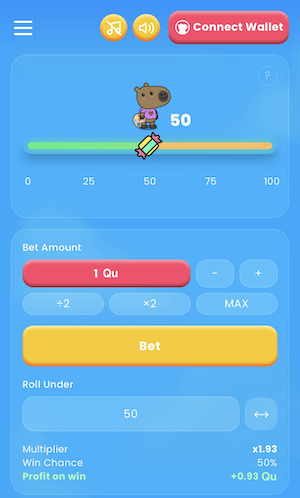
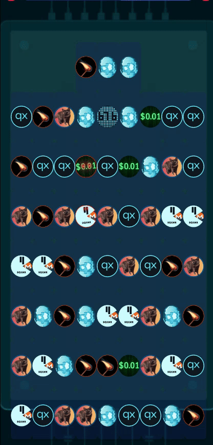

# 🎮 Qubic Game Hub Proposal  
## Launch Game: Qubic Quest (Candy Crush–style)

Proposal to build a **Qubic-powered Game Hub**, beginning with the development and launch of **Qubic Quest**, and expanding into a collection of arcade-style mini-games where players stake, spend, and win Qubic tokens.  

---

## 📚 Table of Contents  

1. [Introduction](#1-introduction)  
2. [Vision: Qubic Game Hub](#2-vision-qubic-game-hub)  
3. [Key Features](#3-key-features)  
4. [How Qubic Quest & Game Hub Benefit Qubic](#4-how-qubic-quest--game-hub-benefit-qubic)  
5. [Example UI](#5-example-ui)  
6. [Revenue & Reward Pools](#6-revenue--reward-pools)  
7. [Revenue Sources](#7-revenue-sources)  
8. [Distribution Logic — Worked Example](#8-distribution-logic--worked-example)  
9. [User Journey](#9-user-journey)  
10. [Player Sustainability](#10-player-sustainability)  
11. [Roadmap & Milestones](#11-roadmap--milestones)  
12. [Payment Terms](#12-payment-terms)  
13. [Team](#13-team)  

---

## 1. Introduction  

The **Qubic Game Hub** introduces mainstream players to Qubic through addictive, fun, and blockchain-backed games.  

The first title, **Qubic Quest**, is a **Candy Crush–style puzzle game** where players can enjoy casual free play or competitive ranked modes. Beyond this flagship launch, the Hub will expand into quick-play arcade and chance-based games, creating **continuous token sinks, engagement, and ecosystem growth**.  

---

## 2. Vision: Qubic Game Hub  

The Hub will be a **collection of mini arcade games** powered by Qubic smart contracts. Players pay small amounts of Qubic to play, compete for rewards, and contribute to token burns, dividends, and charitable allocations.  

### Launch Title: Qubic Quest  
A **Candy Crush–style puzzle game** with two modes:  
- **Casual Mode** – free-to-play, earn small Qubic rewards.  
- **Ranked Mode** – pay Qubic to enter, compete for pooled prize rewards.  

### Future Mini-Games in the Hub  

#### Loot Box  
Spend Qubic to open mystery boxes containing randomized rewards—tokens, cosmetics, or multipliers. 

#### Coinflip  
Classic 50/50 betting game. Stake Qubic on heads or tails, with instant on-chain results. Simple, addictive, and transparent.  

#### Dice  
Predict the roll and wager Qubic. The higher the risk, the higher the payout. Powered by verifiable randomness for provable fairness.  

#### Limbo  
Set your multiplier, bet Qubic, and climb higher with every tick. Cash out for guaranteed profit—or risk it all for massive wins. 

#### Plinky  
Drop a Qubic token into a plinko-style board. Watch it bounce and land in prize slots that pay instantly.   

---

## 3. Key Features  

* **Multi-Game Ecosystem** – A single Hub for puzzle, arcade, and chance-based mini-games.  
* **Smart Contract Distribution** – On-chain rewards, burns, dividends, and charity.  
* **Cross-Platform Launch** – Web, mobile, and desktop builds for maximum adoption.  
* **Persistent Token Utility** – Every play consumes or circulates Qubic.  
* **Player Retention** – Seasonal ladders, streak bonuses, and tournaments.  
* **Integrity & Safety** – Anti-bot protections and proof-of-play validation.  

---

## 4. How Qubic Quest & Game Hub Benefit Qubic  

* **Expands User Base** – Engages casual gamers and competitive players worldwide.  
* **Builds Token Utility** – Play, cosmetics, retries, and entries all consume Qubic.  
* **Reduces Supply** – Smart contract–driven burns maintain deflationary pressure.  
* **Generates Dividends** – Shareholders benefit through recurring payouts.  
* **Boosts Credibility** – Transparent, fair-play contracts improve trust.  
* **Scalable Model** – Adding new games drives continuous growth without reworking core infrastructure.  

---

## 5. Example UI  

  

---

## 6. Revenue & Reward Pools  

* **50% → Player Reward Pool (PRP)** – Payouts, streaks, seasonal ladders.  
* **15% → Operator Fee (OF)** – Operations, development, infrastructure.  
* **15% → Treasury / Reserve** – Marketing, liquidity, contingency.  
* **10% → Shareholder Dividend Pool (SDP)** – Weekly payouts.  
* **5% → Charity** – Automated donations.  
* **5% → Qubic Burn** – Deflationary supply reduction.  

---

## 7. Revenue Sources  

* **Transaction Fees** – From ranked or paid entries.  
* **Cosmetics / Gacha** – Skins, themes, and boosters.  
* **Retry & Streak Recovery** – Small Qubic fees for second chances.  
* **Seasonal Tournaments** – Leaderboard competitions.  
* **Cross-Game Utility** – Shared wallet across all titles in the Hub.  

---

## 8. Distribution Logic — Worked Example  

**Example:** 100 tokens net inflow  

* 50 → PRP  
* 15 → Operator Fee  
* 15 → Treasury / Reserve  
* 10 → Shareholder Dividend Pool  
* 5 → Charity  
* 5 → Qubic Burn  

---

## 9. User Journey  

1. **Onboarding** – Players sign up, connect wallet, and try a tutorial.  
2. **Gameplay** – Choose casual or ranked play, earning rewards.  
3. **Community** – Leaderboards, events, tournaments.  
4. **Rewards** – On-chain payouts and dividend tracking.  

---

## 10. Player Sustainability  

* Fair emissions and capped rewards.  
* Multiple token sinks across all games.  
* Anti-bot and abuse prevention.  
* Ecosystem growth through continuous mini-game expansion.  

---

## 11. Roadmap & Milestones  

### M1 – Backend & Smart Contract Foundation (2 weeks)  
Reward pools, payout logic, and anti-abuse systems.  

### M2 – Web MVP (4 weeks)  
Launch **Qubic Quest** on web with dashboards.  

### M3 – Mobile Apps (6 weeks)  
React Native builds with notifications.  

### M4 – Desktop Build + Game Hub Integration (8 weeks)  
Unified launcher, cosmetic store, cross-game balances.  

---

## 12. Payment Terms  

* **Total Request:** **$12,000 USD (~7.5B Qubic @ 0.0000016)**  

**Breakdown:**  
* Smart Contract Development: $6,000  
* Frontend + UI Development: $5,000  
* Infrastructure & Fees: $1000  

**Disbursement:**  
* M1 – 20%  
* M2 – 30%  
* M3 – 20%  
* M4 – 30%  

---

## 13. Team  

- **Profitphil** – Team Lead  
- **Venus** – Lead Developer *(QWallet, Qexplorer, CFB Meme Generator)*  

---
